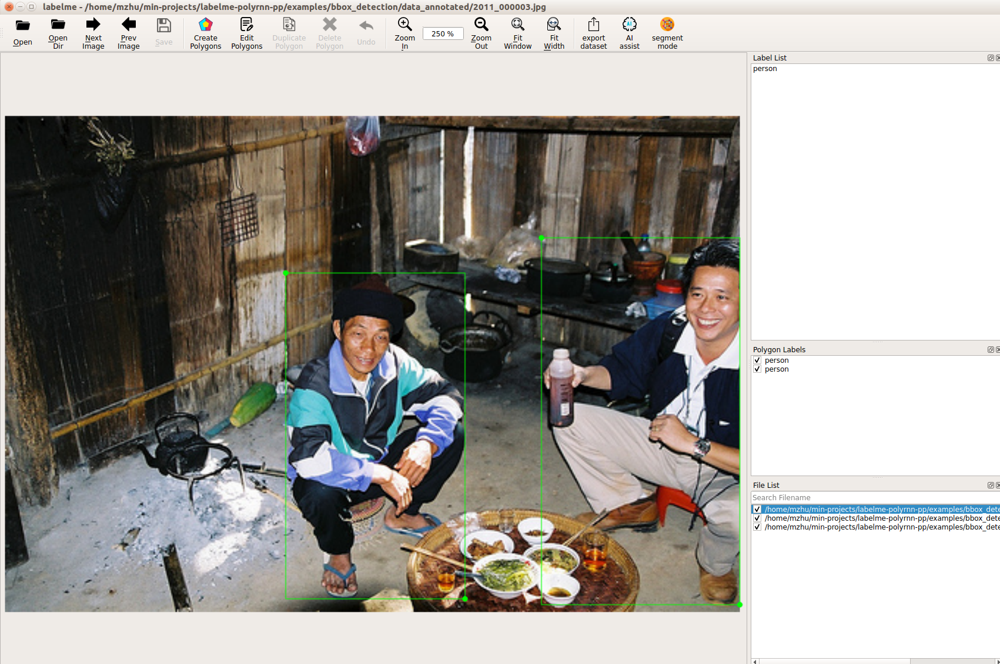
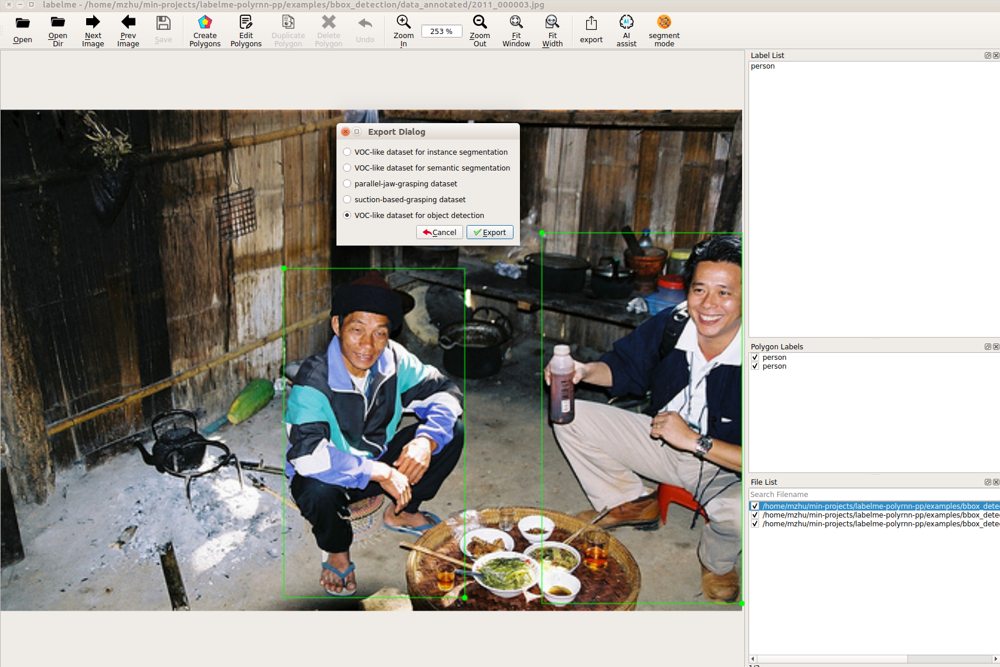
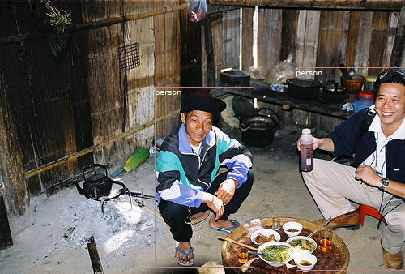

# Bounding Box Detection Example


## Usage

```bash
labelme data_annotated --labels labels.txt --nodata --autosave
```




## Convert to VOC-like Dataset

```bash
# It generates:
#   - data_annotated_detection/JPEGImages
#   - data_annotated_detection/Annotations
#   - data_annotated_detection/AnnotationsVisualization
Click "export" button to export VOC-like dataset of object detection
```



See below examples:

 

<i>Fig1. JPEG image (left), Bounding box annotation visualization (right).</i>
