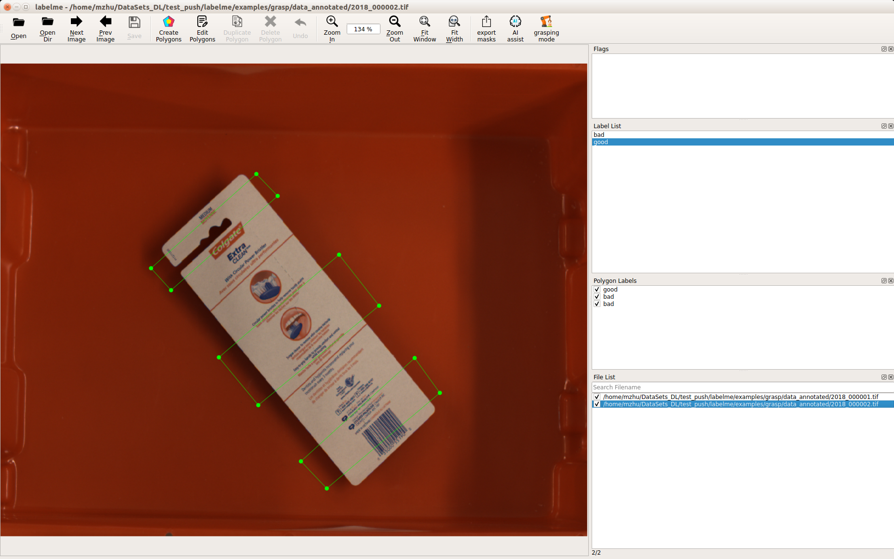
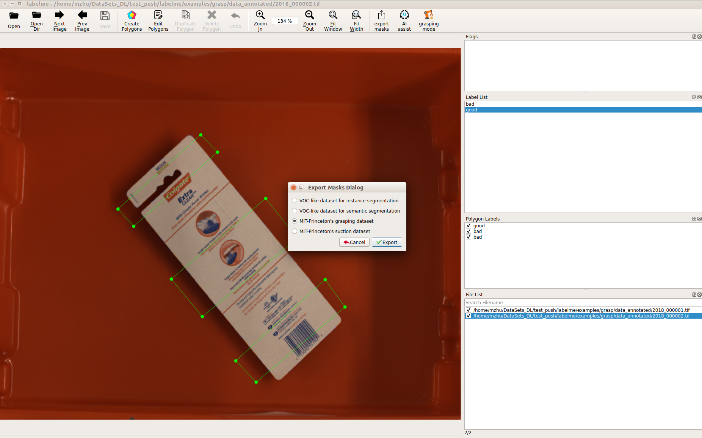
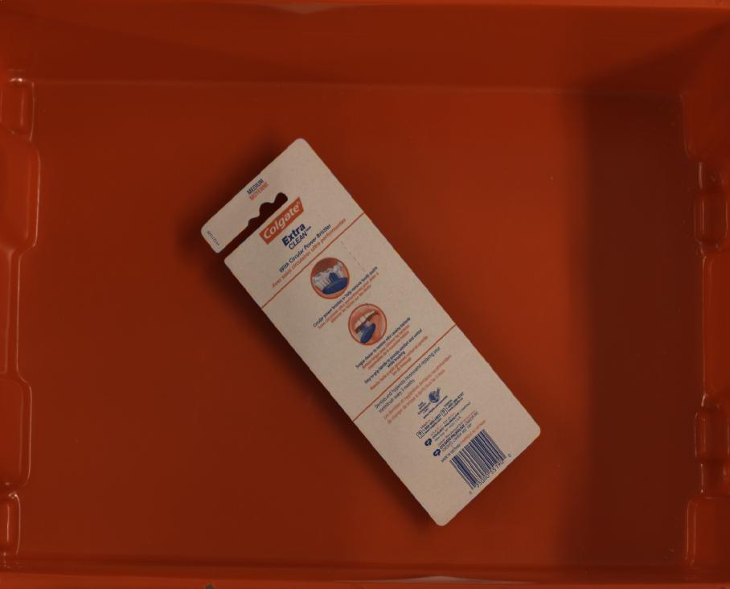
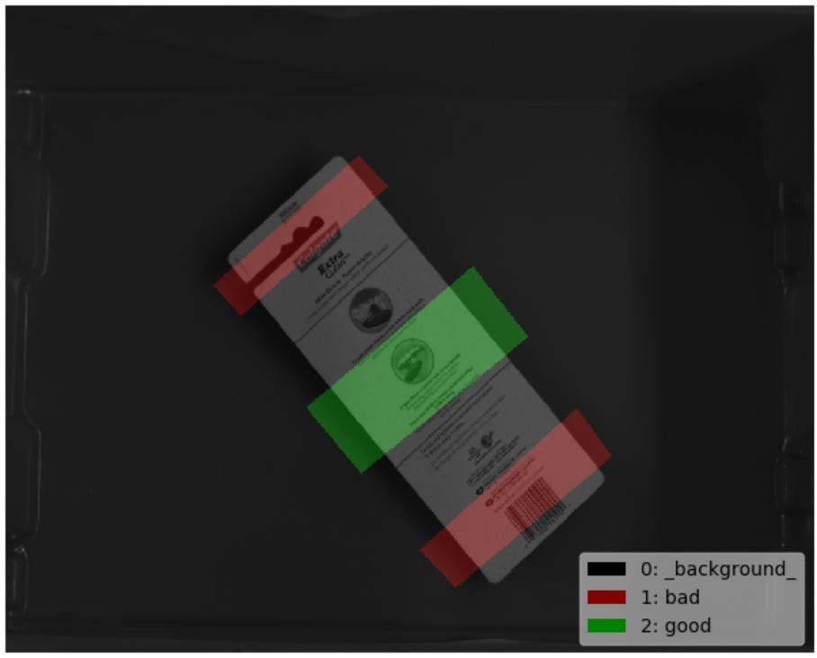
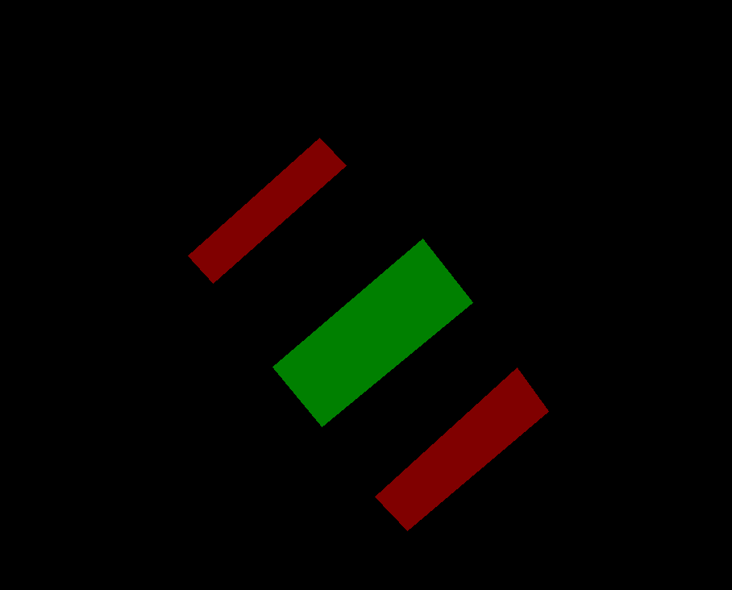

# Grasping Labeling Example

## Annotation

```bash
labelme data_annotated --labels labels.txt --nodata
```



## Convert to grasping Dataset



```bash
# It generates:
#   - data_annotated_grasp/JPEGImages
#   - data_annotated_grasp/GraspingClass
#   - data_annotated_grasp/GraspingClassPNG
#   - data_annotated_grasp/GraspingClassCoordinate
#   - data_annotated_grasp/GraspingClassVisualization
```

    
Fig 1. JPEG image (left), JPEG grasping label visualization (center), PNG grasping label (right)
