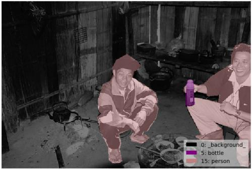
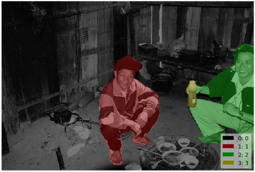

# Instance Segmentation Example

## Annotation

```bash
labelme data_annotated --labels labels.txt --nodata
```


## Convert to VOC-like Dataset


```bash
# It generates:
#   - data_annotated_voc_instance/JPEGImages
#   - data_annotated_voc_instance/SegmentationClass
#   - data_annotated_voc_instance/SegmentationClassVisualization
#   - data_annotated_voc_instance/SegmentationObject
#   - data_annotated_voc_instance/SegmentationObjectVisualization
```

    
Fig 1. JPEG image (left), JPEG class label visualization (center), JPEG instance label visualization (right)


Note that the label file contains only very low label values (ex. `0, 4, 14`), and
`255` indicates the `__ignore__` label value (`-1` in the npy file).  
You can see the label PNG file by following.

```bash
labelme_draw_label_png data_annotated_voc_instance/SegmentationClassPNG/2011_000003.png   # left
labelme_draw_label_png data_annotated_voc_instance/SegmentationObjectPNG/2011_000003.png  # right
```

 
