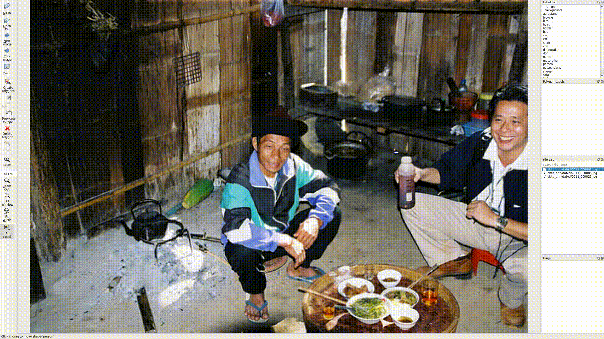

# Semi-automatic Labeling Example

## Annotation



## How to try Polygon RNN ++

```bash
./install_polyrnn.sh
cd src/polyrnn-pp
# Download the pre-trained models and graphs(These models were trained on the Cityscapes Dataset)
./models/download_and_unpack.sh
```

