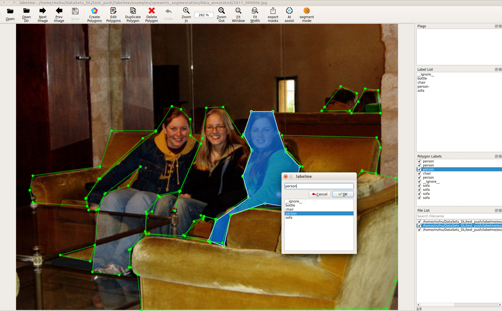
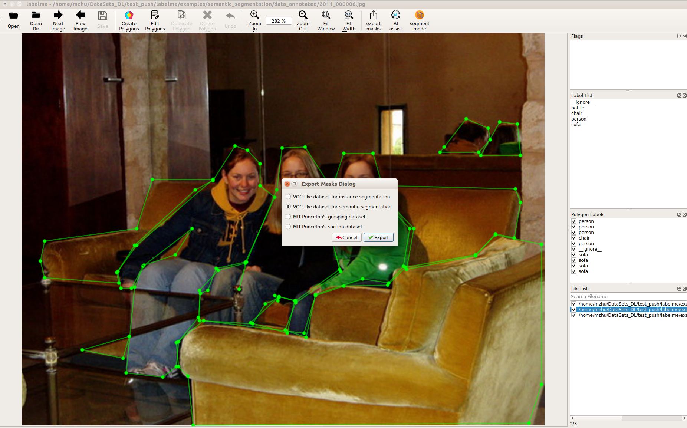
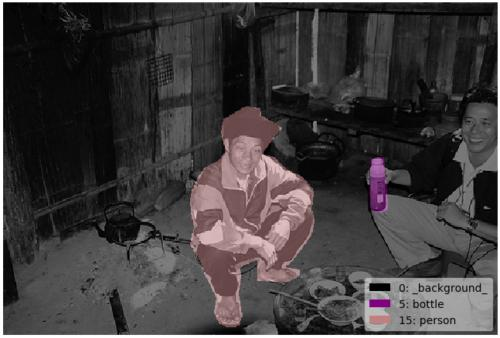

# Semantic Segmentation Example

## Annotation

```bash
labelme data_annotated --labels labels.txt --nodata
```




## Convert to VOC-like Dataset



```bash
# It generates:
#   - data_annotated_voc_semantic/JPEGImages
#   - data_annotated_voc_semantic/SegmentationClass
#   - data_annotated_voc_semantic/SegmentationClassVisualization
```

  

Fig 1. JPEG image (left), PNG label (center), JPEG label visualization (right)  


Note that the label file contains only very low label values (ex. `0, 4, 14`), and
`255` indicates the `__ignore__` label value (`-1` in the npy file).  
You can see the label PNG file by following.

```bash
labelme_draw_label_png data_annotated_voc_semantic/SegmentationClassPNG/2011_000003.png
```


