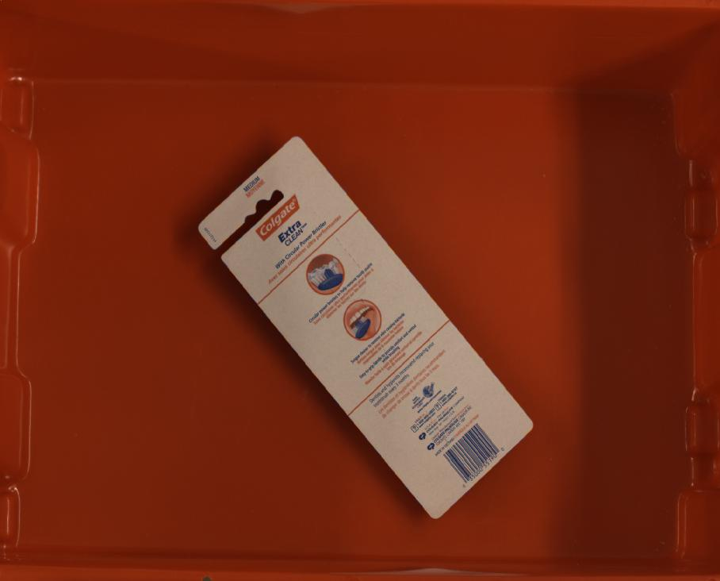

# Suction Labeling Example

## Annotation

```bash
labelme data_annotated --labels labels.txt --nodata
```


## Convert to suction Dataset


```bash
# It generates:
#   - data_annotated_suction/JPEGImages
#   - data_annotated_suction/SuctionClass
#   - data_annotated_suction/SuctionClassPNG
#   - data_annotated_suction/SuctionClassVisualization
```

    
Fig 1. JPEG image (left), JPEG suction label visualization (center), PNG suction label (right)
